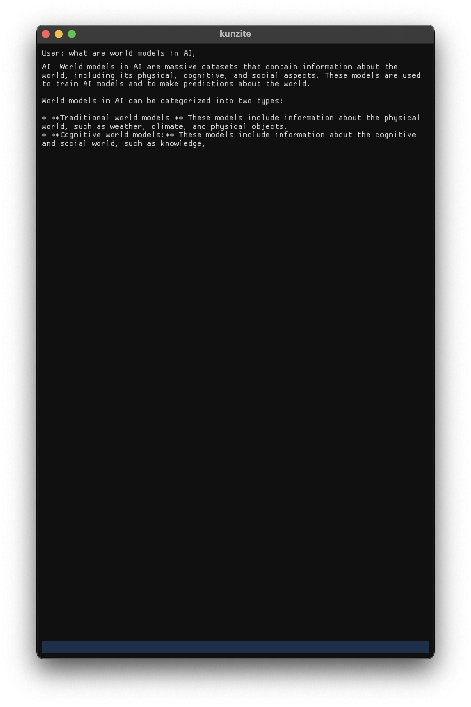
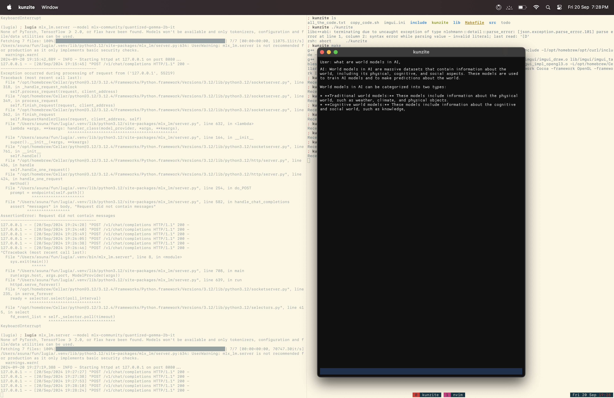

# Kunzite

Kunzite is a lightweight, bloat-free GUI application for local AI chat using the lugia inference engine (based on mlx).

## Features

- **Local AI**: Run AI chat completions entirely on your device
- **MLX Inference Engine**: Utilize Apple's MLX framework for fast, efficient inference
- **On-Device Inference**: Ensure privacy and offline functionality
- **Bloat-Free GUI**: Minimalist interface for distraction-free work

## Quick Start

1. Clone the repository
2. Install dependencies - imgui, lugia
3. Run `make` to build the project
4. Execute `./kunzite` to start the application

- Kunzite uses a simple client-server architecture
- **GUI**: Implemented with Dear ImGui for a lightweight, cross-platform interface
- **LLM Client**: Handles communication with the local inference server
- **MLX Server**: Runs the language model using the MLX framework using [lugia inference engine](http://github.com/vovw/lugia)

## License

This project is licensed under the MIT License
